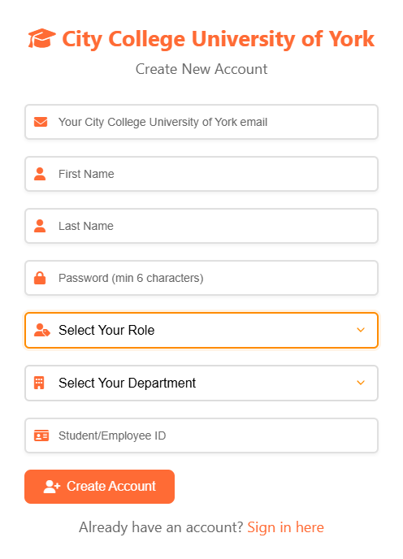
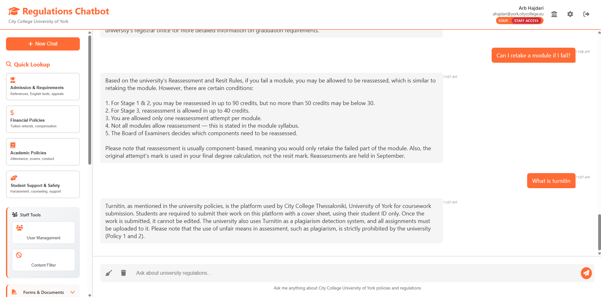
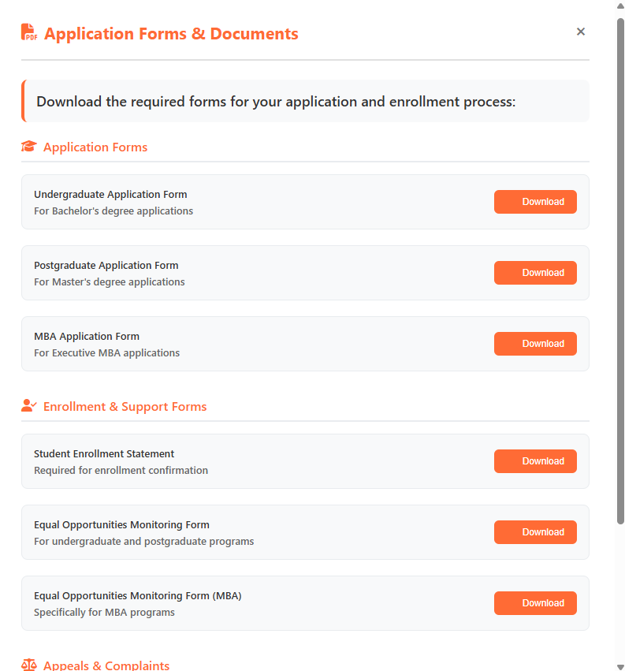
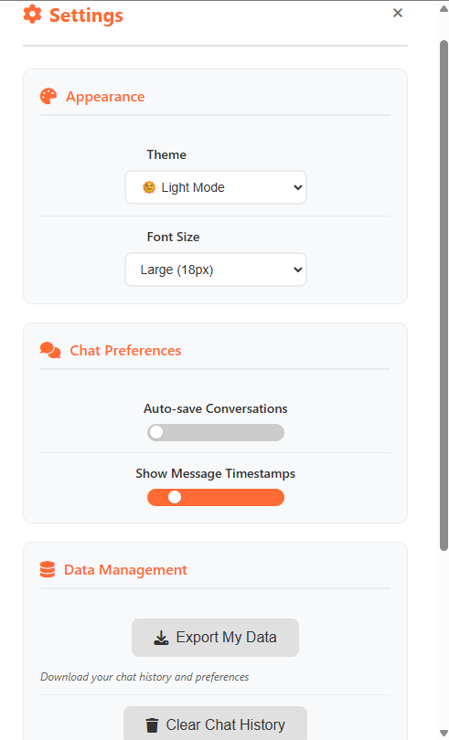
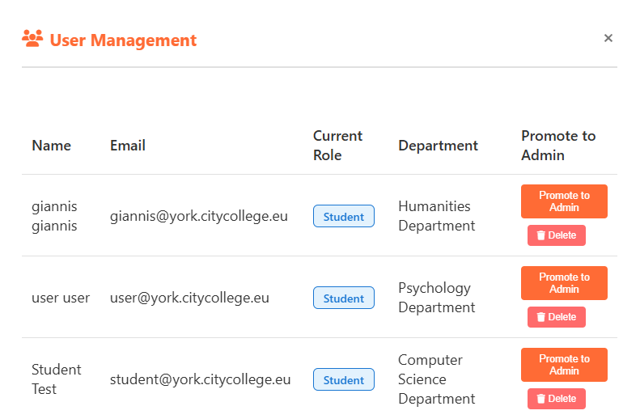
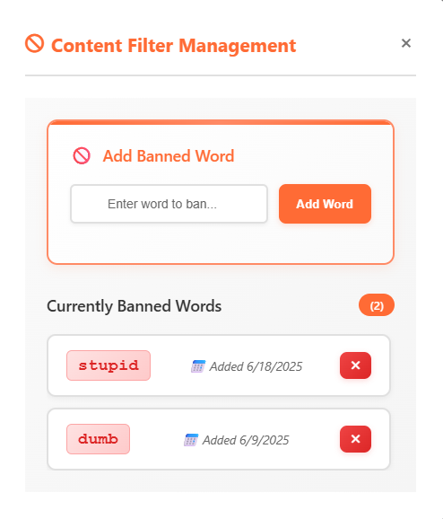

# University Regulations Chatbot

An AI-powered web application that gives students and staff instant answers about university regulations using a Retrieval-Augmented Generation (RAG) pipeline with GPT-4. Built with Node.js, Express, and MongoDB.

## Features
- GPT-4 chatbot with document-based retrieval(RAG)
- Role-based access (student/staff) and JWT auth
- Admin tools for content moderation and user management
- Policy document management with quick lookup categories & document download
- Chat history persistence and a clean, responsive UI

## Tech Stack
Node.js · Express · MongoDB · JWT · OpenAI API

## Project Structure
.
├── middleware/
├── models/
├── routes/
├── services/
├── public/
├── .env.example
├── server.js
└── README.md

## Requirements
- Node.js 18+
- MongoDB (local or Atlas)
- OpenAI API key

## Getting Started
```bash 
git clone https://github.com/arbhajdari/university-regulations-chatbot.git
cd university-regulations-chatbot
npm install
cp .env.example .env   # then fill values
npm run dev            # or: node server.js 
```

## Screenshots

### Login / Register


### Chat Interface


### Forms & Documents


### Settings


### Admin - User Management


### Admin - Content Filter



## License
This project is licensed under the MIT License - see the [LICENSE](LICENSE) file for details.

## Author
Developed by [Arb Hajdari](https://www.linkedin.com/in/arbhajdari)  
Feel free to connect with me!
